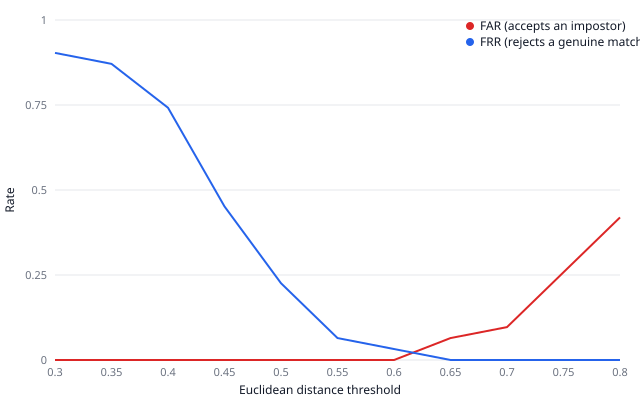

# Face-match FAR/FRR sweep

Measured against 31 genuine pairs and 31 impostor pairs
from the LFW verification-pairs benchmark (`logasja/lfw`, pairs/test split,
fetched via the Hugging Face dataset-viewer API — see
`scripts/face-far-frr-sweep.js`). Descriptors are 128-d embeddings from
`@vladmandic/face-api`'s `faceRecognitionNet`, compared by Euclidean
distance.

| Threshold | FAR (accepts impostor) | FRR (rejects genuine) |
|---|---|---|
| 0.30 | 0.0% | 90.3% |
| 0.35 | 0.0% | 87.1% |
| 0.40 | 0.0% | 74.2% |
| 0.45 | 0.0% | 45.2% |
| 0.50 | 0.0% | 22.6% |
| 0.55 | 0.0% | 6.5% |
| 0.60 | 0.0% | 3.2% |
| 0.65 | 6.5% | 0.0% |
| 0.70 | 9.7% | 0.0% |
| 0.75 | 25.8% | 0.0% |
| 0.80 | 41.9% | 0.0% |

## Chosen operating point

`FACE_MATCH_THRESHOLD = 0.6` in `issuer/src/pipeline/facematch.js`
— the most permissive threshold tested that still keeps FAR at or below
5%, per Section 9.2's guidance to bias toward rejecting impostors (which
fall through to human review) over accepting them. Loosening the
threshold further buys a lower FRR but starts letting impostor pairs
through; tightening it below this point only adds more genuine pairs to
the review queue for no FAR benefit, since FAR is already 0% here.

## Caveats

- ID-photo-vs-selfie matching (this project's actual use case) is harder
  than the selfie-to-selfie matching LFW's pairs approximate — LFW pairs
  are both "in the wild" candid photos of similar quality/pose, not one
  studio-lit ID photo against one phone selfie. This threshold is a
  reasonable starting point, not a validated production number.
- A handful of LFW pairs are skipped where the detector couldn't find
  exactly one face in the sample photo (profile shots, occlusion, more
  than one person in frame) — this affects the exact sample size, not the
  methodology.
- This script hits the network (Hugging Face) and is not run in CI; its
  committed output (this file + the chart) is the artifact that matters.
